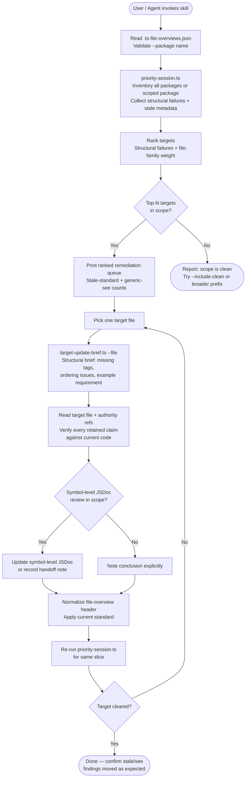

# ts-file-overviews
A portable Claude Code skill for auditing and normalizing TypeScript file-overview headers against a project's documented standards. It covers inventory, prioritization scoring, per-file structural briefs, stale-metadata detection, and a repeatable remediation loop — without hardcoding any package names or format rules.

## Install

The fastest cross-agent install path is the `skills` CLI:

```bash
npx skills add gg-skills/ts-file-overviews
```

Drop this skill into a workspace as a Git submodule for pinned versions, or as a plain clone for latest `main`:

```bash
# Project-local, version-pinned:
git submodule add git@github.com:gg-skills/ts-file-overviews.git .claude/skills/ts-file-overviews

# OR project-local, latest main:
mkdir -p .claude/skills
git -C .claude/skills clone git@github.com:gg-skills/ts-file-overviews.git

# OR user-level, available in every project on this machine:
mkdir -p ~/.claude/skills
git -C ~/.claude/skills clone git@github.com:gg-skills/ts-file-overviews.git
```

Restart your agent or reload skills after installation. See the parent [`skills` catalog repo](https://github.com/gg-skills/skills) for the full catalog.

## When to use

- A user asks to audit, review, fix, or normalize TypeScript file-overview headers.
- The task involves `@fileoverview`, `@testing`, `@see`, or `@documentation` tags in `.ts` or `.tsx` files.
- A user references the host project's file-overview standards documentation.
- A code review or lint output flags stale file-overview metadata or generic `@see` suffixes.

Skip it when the task is about runtime behavior, business logic, or general code quality (not documentation headers); when the files are not TypeScript or TSX; or when the task is purely about JSDoc on individual symbols without any file-level header review.

## How it operates

### Inputs

**`.ts-file-overviews.json`** — required config file in the host project root. Lists the packages the scripts will scan and prioritize. Each entry declares:

- `name` — identifier used with `--package <name>`; must be unique.
- `rootPath` — path relative to the repo root where the package lives.
- `tsconfigPath` — optional; path to a per-package tsconfig.

```json
[
  { "name": "root", "rootPath": "." },
  { "name": "my-lib", "rootPath": "packages/my-lib", "tsconfigPath": "packages/my-lib/tsconfig.json" }
]
```

Scripts load this config at runtime and validate `--package <name>` against it. No hardcoded package names exist in the scripts themselves.

**Host project audit commands** — npm scripts wired to the `scripts/file-overview-standards/` family inside the host project (e.g. `file-overview-standards:priority-targets`, `file-overview-standards:target-brief`). The skill orchestrates these but does not bundle them.

**CLI flags** for the skill-level wrapper scripts:

| Flag | Script | Effect |
|------|--------|--------|
| `--limit <N>` | `priority-session.ts` | Cap the ranked target list (default: 15) |
| `--package <name>` | `priority-session.ts` | Scope to one package entry from `.ts-file-overviews.json` |
| `--json` | `priority-session.ts` | Emit structured JSON instead of interactive prose |
| `--file <repo-path>` | `target-update-brief.ts` | Generate a structural brief for a single file (repo-relative path) |

### Outputs

**`priority-session.ts`** — prints a ranked remediation queue combining:
- structural failure counts per file
- stale standard-version hits
- generic `@see` suffix counts
- top-N priority targets for the selected package or all packages

With `--json`, emits a machine-readable array of target objects for downstream tooling.

**`target-update-brief.ts`** — prints a per-file structural brief showing which required tags are missing, which are out of order, and whether `@example` is required — all before the header is manually normalized.

Neither script writes back to the host project; all output goes to stdout.

### External commands

```bash
# Skill-level wrappers (run from the host project root):
npx tsx skills/ts-file-overviews/scripts/priority-session.ts --limit 15
npx tsx skills/ts-file-overviews/scripts/priority-session.ts --limit 10 --json
npx tsx skills/ts-file-overviews/scripts/priority-session.ts --package my-lib --limit 10
npx tsx skills/ts-file-overviews/scripts/target-update-brief.ts --file packages/my-lib/src/index.ts

# Host-project audit scripts (wired in the host's package.json):
npm run file-overview-standards:priority-targets
npm run file-overview-standards:target-brief -- --file <repo-relative-path>
npm run file-overview-standards:stale-standard-version
npm run file-overview-standards:stale-review-dates
npm run file-overview-standards:generic-see-suffixes
```

### Side effects

- **Read-only against the host project.** Neither script modifies any source file; all output is stdout only.
- **No installation footprint.** No config files, caches, or state directories are created in the host project by the skill scripts.
- **Audit commands are invoked as subprocesses.** The wrapper scripts shell out to the host project's npm scripts; those scripts may cache intermediate results per their own design.

### Mode toggles

| Toggle | Effect |
|--------|--------|
| `--json` | Machine-readable output instead of interactive prose; safe for agent-operated pipelines |
| `--package <name>` | Scope the session to a single package; required when a repo has many packages and an unscoped audit returns an unactionable result set |
| `--limit <N>` | Caps the priority target list; start at 10–15 before widening scope |

## Operational flow



## Layout

```
.
├── SKILL.md                          ← entry point: workflow, policy, quick commands, pitfalls
├── README.md                         ← this file
├── tsconfig.json                     ← TypeScript config for the wrapper scripts
├── agents/
│   └── openai.yaml                   ← agent descriptor for IDE skill surfacing
├── assets/                           ← skill icons (large/small/master + SVG sources)
│   ├── icon-large.png
│   ├── icon-large.svg
│   ├── icon-master.png
│   └── icon-small.svg
├── references/
│   └── command-contract.md           ← precise flags, output intent, and command split
└── scripts/
    ├── priority-session.ts           ← operator-facing session entrypoint (inventory + ranked queue)
    └── target-update-brief.ts        ← per-file structural remediation brief generator
```

`tsconfig.json` sits at the skill root so `npx tsx` resolves types correctly for the wrapper scripts without touching the host project's own TypeScript config.

## Quick start

Read [`SKILL.md`](./SKILL.md) first — it carries the workflow steps, non-negotiable policy, common pitfalls, a command decision guide, and a troubleshooting matrix.

1. Create `.ts-file-overviews.json` in the host project root (see [Inputs](#inputs) above).
2. Wire the host project's `file-overview-standards:*` npm scripts to the audit library (see `references/command-contract.md`).
3. Run the session entrypoint to get a ranked queue:

```bash
# From the host project root:
npx tsx skills/ts-file-overviews/scripts/priority-session.ts --limit 15

# Scope to one package:
npx tsx skills/ts-file-overviews/scripts/priority-session.ts --package my-lib --limit 10

# JSON output for downstream tooling:
npx tsx skills/ts-file-overviews/scripts/priority-session.ts --limit 10 --json
```

4. Before editing any file, generate its structural brief:

```bash
npx tsx skills/ts-file-overviews/scripts/target-update-brief.ts --file packages/my-lib/src/utils.ts
```

5. Re-read the target file and verify every retained claim against the current code, then normalize the header.
6. Re-run the session for the same slice and confirm the target cleared.

## Resources

- [`SKILL.md`](./SKILL.md) — full operating guidance, workflow steps, policy, command decision guide, troubleshooting matrix.
- [`references/command-contract.md`](./references/command-contract.md) — precise flags, output intent, and the split between root audit commands and skill-level wrapper commands.
- [`scripts/priority-session.ts`](./scripts/priority-session.ts) — operator-facing session entrypoint.
- [`scripts/target-update-brief.ts`](./scripts/target-update-brief.ts) — per-file structural remediation brief generator.
- [`agents/openai.yaml`](./agents/openai.yaml) — agent descriptor for IDE skill surfacing.

## Caveats

- **Consumers must supply their own format source of truth.** The skill does not bundle a file-overview standards document. The host project must provide one (e.g. `docs/TYPESCRIPT_STANDARDS_DOCUMENTATION_FILE_OVERVIEWS.md`) and the agent must read it before editing any header.
- **A clean audit result is not proof of accuracy.** The audit checks structure and metadata only — stale prose that passes structural checks must still be rewritten if claims no longer match the current code.
- **Always scope before running.** Use `--package` or `--path-prefix` to keep the result set actionable. Unscoped audits on large repos can return hundreds of files and stall the session.
- **Generic `@see` suffixes are banned.** Suffixes such as `High-stakes consumer` or `Authority` without context must be replaced with descriptions that explain why the target matters.
- **Do not bulk-rewrite entire repos.** Prefer small, package-bounded cleanup slices to reduce risk and review burden.
- **Symbol-level JSDoc is not out of scope.** If file-overview review exposes missing or stale symbol-level detail, either update it in scope or record an explicit handoff note — never silently skip it.
- **`--file` paths must be repo-relative.** Absolute paths will cause `target-update-brief.ts` to throw a "file does not exist" error.
